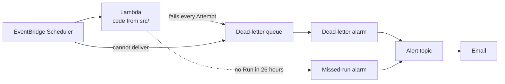

# Python service skeleton

[](https://github.com/axiom-maths/python-service-skeleton/actions/workflows/ci.yaml)

A template for a Python service on AWS. The application is in `src/` and its
infrastructure, in CDK Python, is in `infra/`. Both are linted, type-checked and tested,
and a merge to `main` deploys through GitHub Actions with no stored AWS keys.

The skeleton is a working project, not a template that only works once rendered. CI
checks it exactly as it checks anything started from it, and `scripts/rename.py` turns a
copy into your project.

## What's included

- **An example Service.** A Lambda on an EventBridge schedule whose Failures and Missed
  runs reach a person. Keep the shape and replace the contents.
- **An alerts stack.** The Project's monthly budget, and the SNS topic its alarms
  notify.
- **A deploy pipeline.** GitHub Actions assumes a per-repository IAM role through OIDC.
- **Tooling.** uv, ruff, `mypy --strict` and pytest over both projects, and a pinned CDK
  CLI. Workflow actions are pinned to commit SHAs, and Dependabot keeps them and every
  dependency current.



## Quick start

Needs [uv](https://docs.astral.sh/uv/), Node and the AWS CLI v2.

```bash
gh repo create <owner>/<name> --private --template axiom-maths/python-service-skeleton --clone
cd <name>
uv run python scripts/rename.py --name <name> --github <owner>/<name>
```

Set `ACCOUNT` and `ALERT_EMAIL` in `infra/config.py`, then:

```bash
make install   # both projects, and the pinned CDK CLI
make ci        # lint, typecheck, test and synth
```

The script deletes itself once it has run. Rewrite this README for your project, add
your domain's terms to `CONTEXT.md` under a heading of their own, and commit. Choose the
name with care: it prefixes every stack, and CloudFormation cannot rename a stack.

To deploy, see [docs/infra.md](docs/infra.md).

## Layout

```
src/                 the application, shipped to Lambda as it stands
tests/               the application's tests
infra/               the infrastructure, a separate uv project
  config.py          every value a new project changes
  app.py             the stacks, and the order they deploy in
  stacks/            one module per stack
scripts/rename.py    run once on a fresh copy; it deletes itself
```

`make help` lists every command.

## Documentation

- [docs/development.md](docs/development.md): day-to-day work, writing handlers, adding
  stacks, dependencies and secrets
- [docs/infra.md](docs/infra.md): the stacks, deploying, the pipeline and costs
- [docs/aws-access.md](docs/aws-access.md): setting up AWS SSO profiles
- [docs/adr/](docs/adr/): why it is shaped this way, one decision per file

## Licence

[MIT](LICENSE). A project started from the skeleton can choose its own licence. MIT asks
only that the skeleton's copyright notice stays with the code that came from it.
